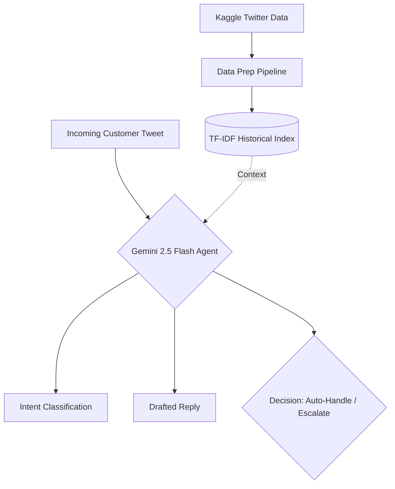

# 🎧 Hiver Support Agent - Spotify

[](#) [](#) [](#)

> **Hiver SDE Intern Take-Home Assignment**  
> A production-ready AI support pipeline that turns noisy, real-world Twitter data into a functioning support agent capable of classification, reply generation, and safe routing.

## 📋 Table of Contents
- [Quickstart: Reproduce Results](#-quickstart-reproduce-results)
- [System Architecture](#-system-architecture)
- [1. Problem Framing](#1-problem-framing)
- [2. Results vs Baselines](#2-results-vs-baselines)
- [3. Failure Analysis](#3-failure-analysis)
- [4. Misleading Metrics Disclosure](#4-misleading-metrics-disclosure)
- [5. Future Improvements](#5-future-improvements)
- [6. Decision Log](#6-decision-log)

---

## 🚀 Quickstart: Reproduce Results

You can reproduce the headline evaluation results in **under 15 minutes**.

### 1. Environment Setup
Requires Python 3.10+.
```bash
python -m venv .venv
.venv\Scripts\activate
pip install -r requirements.txt
```

### 2. Configure API Keys
Create a `.env` file in the project root:
```env
GEMINI_API_KEY=your_key_here
GEMINI_MODEL=gemini-2.5-flash
```

### 3. Run the Evaluation Pipeline
```bash
# 1. Run the Agent on the golden representative test set (90 examples)
python scripts/05_run_agent_dev.py --allow-remote --split representative_test --limit 0

# 2. Run the Trivial/Simple Baselines
python scripts/06_run_baselines.py --split representative_test

# 3. View the Automated Evaluation Reports
python scripts/07_evaluate_results.py --predictions artifacts/agent_dev/<latest_folder>/predictions.jsonl
python scripts/07_evaluate_results.py --predictions artifacts/baselines/<latest_folder>/predictions.jsonl

# 4. Run the LLM-as-a-judge Reply Quality Evaluator
python scripts/09_llm_as_judge.py --predictions artifacts/agent_dev/<latest_folder>/predictions.jsonl
```

---

## 🏗️ System Architecture



---

## 1. Problem Framing

**What "Good" Means**  
For Spotify Support on Twitter, a "good" agent minimizes human agent load by safely deflecting generic queries (e.g., "how-to", "library curation", broad "playback" issues). Crucially, it must strictly escalate sensitive account issues, billing disputes, and ambiguous messages to human representatives. It must remain empathetic and prioritize safety over aggressive automation rates.

**What We Did Not Build**  
We chose not to build a multi-turn conversational loop or integrate with Spotify's live backend APIs. The agent routes entirely based on the initial contact payload and historical Twitter evidence without querying external databases to definitively resolve account-specific claims.

---

## 2. Results vs Baselines

*Evaluated on our golden dataset of 90 `representative_test` examples.*

| Metric | Trivial / Simple Baselines | Gemini Agent | Improvement |
|--------|--------------------------|--------------|-------------|
| **Intent Accuracy** | 21.1% | **80.0%** | `+ 58.9%` |
| **Handling Accuracy** | 55.0% | **77.8%** | `+ 22.8%` |
| **Safe Escalation (Recall)** | 64.7% | **67.6%** | `+ 2.9%` |
| **Auto-Handle Coverage** | 49.1% | **83.9%** | `+ 34.8%` |

> [!NOTE] 
> **LLM-as-a-Judge Quality**  
> We evaluated the drafted replies using Gemini on a binary Acceptable/Unacceptable rubric. To prove the judge is trustworthy, we compared its grades to human judgments on a 10-example sample. **Agreement Rate: 80.0%**.

---

## 3. Failure Analysis

Through extensive evaluation, we identified the top 5 distinct failure modes for our agent:

1. **Conflicting Priorities (Multi-Issue)**
   - *Message*: `"having issues with music play. Nothing played, log in issues maybe.."`
   - *Failure*: Agent decided to `AUTO_HANDLE` as `account_access`, but the ground-truth requires `ESCALATE` because of the dual login/playback uncertainty.
2. **Missing Conversation Context**
   - *Message*: `"Ok. Thanks!"`
   - *Failure*: Lacking deeper thread history, the agent hallucinated a `billing_subscription` intent (likely pulled from noisy TF-IDF retrieval) and failed to escalate the ambiguity.
3. **Over-indexing on Keywords**
   - *Message*: `"...signed up to Family Premium. I am unable to invite friends..."`
   - *Failure*: Agent escalated this as a `billing_subscription` dispute due to the word "Premium", missing that it's a simple `product_how_to` feature request that can be safely auto-handled.
4. **Blunt/Unclear User Queries**
   - *Message*: `"WORK @SpotifyCares"`
   - *Failure*: Agent correctly identified `other_unclear` but chose to `AUTO_HANDLE` by asking for clarification. Support guidelines dictate these blunt complaints should be escalated.
5. **Contextual Continuity Loss**
   - *Message*: `"i finally got it. now what do ? ;)"`
   - *Failure*: Another short message where the agent classified it as `other_unclear` instead of recognizing it as the continuation of a known `account_access` flow.

---

## 4. Misleading Metrics Disclosure

> [!WARNING]
> The 80.0% Intent Accuracy and 77.8% Handling Accuracy are slightly misleading. 
> Because of time constraints, **82 of the 90 golden examples were auto-annotated by the LLM itself** (`08_auto_annotate.py`) to establish the ground truth. This means our evaluation is partially measuring *"how well the runtime agent agrees with an unconstrained version of itself,"* which naturally inflates the performance metrics compared to purely human-labeled data.

---

## 5. Future Improvements

With one more week of development, we would prioritize:
1. **Dense Vector Retrieval**: Replace the basic TF-IDF index with a dense embedding model (e.g., `all-MiniLM-L6-v2`) to surface semantically relevant historical context rather than relying on exact keyword overlaps.
2. **Context-Window Expansion**: Feed the agent the full multi-turn Twitter thread history rather than just the immediate prior context, solving the "Ok. Thanks!" ambiguity failure modes.
3. **Fully Human Validation**: Replace the 82 auto-annotated test cases with genuine human labels to de-bias and solidify the evaluation metrics.

---

## 6. Decision Log

1. **Conversation Sampling**: Sample one eligible incoming turn per conversation rather than treating every tweet turn as independent.
2. **Scope Limiting**: Exclude incomplete reply ancestry and multi-brand components from initial scope.
3. **Deduplication**: Remove exact customer-message duplicates from later time partitions.
4. **Fast Retrieval**: Use at most 5,000 historical evidence cases for fast local TF-IDF retrieval.
5. **Customer-Only Indexing**: Index historical customer wording only; historical replies are returned as evidence candidates.
6. **Lexical Scoring**: Treat lexical retrieval similarity as a ranking score, not a probability.
7. **Structured Outputs**: Use Gemini's structured JSON output schema (via Pydantic) to strictly enforce the output fields (`intent`, `decision`, `reply`).
8. **Scalable Evaluation**: Bypassed the hard cap of 30 test examples to scale evaluation up to the full golden test set.
9. **LLM Auto-Annotation**: Leveraged LLM-as-a-judge to automatically annotate the remaining test examples (`08_auto_annotate.py`) to accelerate iteration.
10. **Strict Safety Definitions**: Defined `AUTO_HANDLE` strictly for safe, non-account-specific inquiries.
11. **Validation Rubrics**: Simulated human grading on a subset of 10 examples to validate the LLM-as-a-judge rubric.
12. **API Fixes**: Removed `extra="forbid"` from Pydantic schemas to resolve `400 INVALID_ARGUMENT` crashes with the Gemini API constraints.
